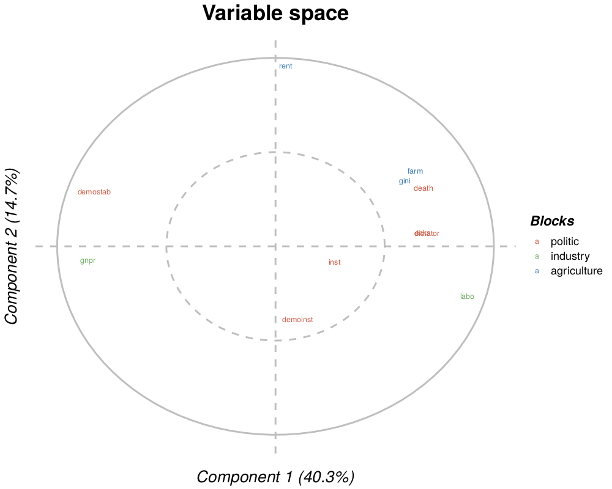
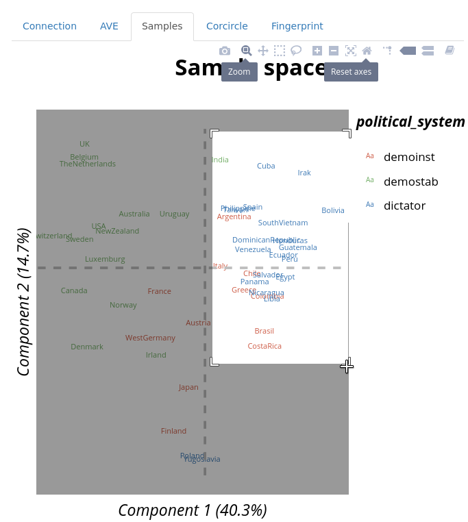
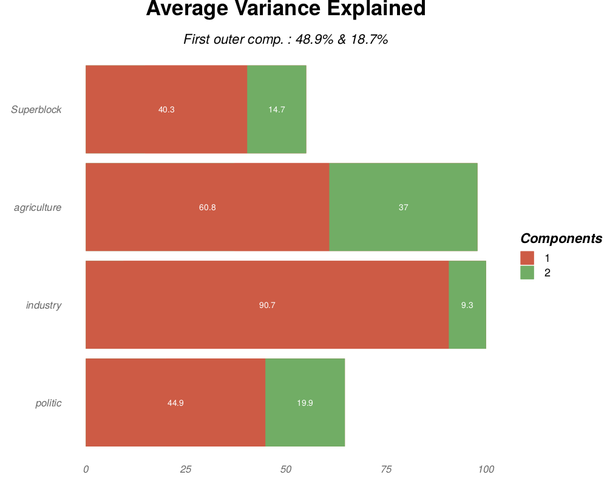

# R/SGCCA in command-line and Shiny graphical interface

##### Version: 1.0

##### Author: Etienne CAMENEN

##### Key-words: 
omics, RGCCA, multi-block

##### EDAM operation: 
analysis, correlation, visualisation

##### Contact: 
arthur.tenenhaus@l2s.centralesupelec.fr

##### Short description
Performs multi-variate analysis (PCA, CCA, PLS, R/SGCCA, etc.) and produced textual and graphical outputs (e.g. variables and  individuals plots).

---

## Description
A user-friendly multi-blocks analysis (Regularized Generalized Canonical Correlation Analysis, RGCCA) as described in [1] and [2] with all default settings predefined. The software produces figures to explore the analysis' results: samples and variables projected on two component of the multi-block analysis, list of top variables and explained variance in the model.
 
## R/SGCCA (from the [CRAN vignette](https://cran.r-project.org/web/packages/RGCCA/vignettes/vignette_RGCCA.pdf) [3])
We consider J data matrices X1 ,..., XJ. Each n × pj data matrix Xj = [ xj1, ..., xjpj ] is called a block and represents a set of pj variables observed on n individuals. The number and the nature of the variables may differ from one block to another, but the individuals must be the same across blocks. We assume that all variables are centered. The objective of RGCCA is to find, for each block, a weighted composite of variables (called block component) yj = Xj . aj, j = 1 ,..., J (where aj is a column-vector with pj elements) summarizing the relevant information between and within the blocks. The block components are obtained such that (i) block components explain well their own block and/or (ii) block components that are assumed to be connected are highly correlated. In addition, RGCCA integrates a variable selection procedure, called SGCCA, allowing the identification of the most relevant features.

The second generation RGCCA ([1]) subsumes fifty years of multiblock component methods. It provides important improvements to the initial version of RGCCA ([2]) and is defined as the following optimization problem: 
- The **scheme function** g is any continuous convex function and allows to consider different optimization criteria. Typical choices of g are the identity (horst scheme, leading to maximizing the sum of covariances between block components), the absolute value (centroid scheme, yielding maximization of the sum of the absolute values of the covariances), the square function (factorial scheme, thereby maximizing the sum of squared covariances), or, more generally, for any even integer m, g(x) = x^m (m-scheme, maximizing the power of m of the sum of covariances). The horst scheme penalizes structural negative correlation between block components while both the centroid scheme and the m-scheme enable two components to be negatively correlated. According to [4], a fair model is a model where all blocks contribute equally to the solution in opposition to a model dominated by only a few of the J sets. If fairness is a major objective, the user must choose m = 1. m > 1 is preferable if the user wants to discriminate between blocks. In practice, m is equal to 1, 2 or 4. The higher the value of m the more the method acts as block selector [5].
- The **design matrix** C is a symmetric J × J matrix of nonnegative elements describing the network of connections between blocks that the user wants to take into account.  Usually, cjk = 1 for two connected blocks and 0 otherwise.
- The τj are called **shrinkage parameters** ranging from 0 to 1 and interpolate smoothly between maximizing the covariance and maximizing the correlation. Setting the τj to 0 will force the block components to unit variance (var(Xj.aj = 1)), in which case the covariance criterion boils down to the correlation. The correlation criterion is better in explaining the correlated structure across datasets, thus discarding the variance within each individual dataset.  Setting τj to 1 will normalize the block weight vectors (aj . t(aj) = 1), which applies the covariance criterion. A value between 0 and 1 will lead to a compromise between the two first options and correspond to the following constraint (1 − τj) . var(Xj.aj) + τj‖aj‖^2 = 1. The choices τj = 1, τj = 0 and 0 < τj < 1 are respectively referred as Modes A, B and Ridge. In the RGCCA package, for each block, the determination of the shrinkage parameter can be made fully automatic by using the analytical formula proposed by (Schäfer and Strimmer 2005). Also, depending on the context, the shrinkage parameters should also be determined based on V-fold cross-validation. We can define the choice of the shrinkage parameters by providing interpretations on the properties of the resulting block components:
    - τj = 1 yields the maximization of a covariance-based criterion. It is recommended when the user wants a stable component (large variance) while simultaneously taking into account the correlations between blocks. The user must, however, be aware that variance dominates over correlation.
    - τj = 0 yields the maximization of a correlation-based criterion. It is recommended when the user wants to maximize correlations between connected components. This option can yield unstable solutions in case of multi-collinearity and cannot be used when a data block is rank deficient (e.g. n < pj).
    - 0 < τj < 1 is a good compromise between variance and correlation: the block components are simultaneously stable and as well correlated as possible with their connected block components. This setting can be used when the data block is rank deficient.

The quality and interpretability of the RGCCA block components yj = Xj . aj, j = 1,...,J are likely affected by the usefulness and relevance of the variables of each block. Accordingly, it is an important issue to identify within each block a subset of significant variables which are active in the relationships between blocks. **SGCCA** extends RGCCA to address this issue of variable selection. Specifically, RGCCA with all τj = 1 equal to 1 is combined with an L1-penalty that gives rise to SGCCA [6]. The SGCCA optimization problem is defined with sj, a user defined positive constant that determines the amount of sparsity for aj, j = 1,...,J. The smaller the sj, the larger the degree of sparsity for aj. The sparsity parameter sj is usually set based on cross-validation procedures. Alternatively, values of sj can simply be chosen to result in desired amounts of sparsity.

## Input files 
(see ```int/extdata/``` folder for a [working example](https://github.com/BrainAndSpineInstitute/rgcca_Rpackage/tree/master/inst/extdata)).
- ```blocks``` (.tsv, .csv, .txt or .xls, xlsx) : file(s) containing variables to analyse together.
The samples should be in lines and labelled and variables in columns with a header. With an Excel format, each block 
must be in a separated sheet. For other format, each blocks must be in a separated file.
- ```connection``` (.tsv, .csv, .txt or .xls, xlsx) : file without header, containing a symmetric matrix
of non-negative elements describing the network of connections between blocks that the user wants to take into account.
Its dimension should be NB_BLOCKS + 1) * (NB_BLOCKS + 1). + 1 corresponds for the use of a supplementary block 
(the "superblock"), a concatenation of all the blocks helpful to interpret the results. By default, the connection
matrix is build with values for the last line (and column) except for the diagonal (i.e., the superblock is fully
connected with the other blocks) and 0 values for the other cells (the blocks are not connected together). 
To go further than this null hypothesis, a priori information could be used to tune the matrix (e.g., add 1 value 
for a connection between two block).
- ```response``` (.tsv, .csv, .txt or .xls, xlsx) : an only column of of either a qualitative, or a quantitative variable 
or multiple columns containing a disjunctive table.

## Output files 
- ```corcircle``` (.pdf, .png, .tiff, .bmp or .jpeg) : samples projected in a space composed by the first two components of the analysis (with the percent of explained variance). By selecting a response, samples are colored according to this criterion.



- ```samples_space``` (.pdf, .png, .tiff, .bmp or .jpeg) : circle of correlation of variables with the first two components of the analysis (with the percent of  explained variance). The dotted circle corresponds to a 0.5 correlation and the full one corresponds to a 1 correlation.



- ```fingerprint``` (.pdf, .png, .tiff, .bmp or .jpeg) : 100 best biomarkers for a set of blocks according to the weight of these variables in the analysis (eigen value for PCA, canonical variable for CCA, component for PLS and RGCCA).


- ```ave``` (.pdf, .png, .tiff, .bmp or .jpeg) : average variance explained (in %) in the model for each block ranked decreasingly.




## Installation
Required:
- Softwares : R
- R libraries : see the [DESCRIPTION](https://github.com/BrainAndSpineInstitute/rgcca_Rpackage/blob/release/3.0/DESCRIPTION) file.

### Linux

```
sudo apt-get install -y --no-install-recommends git && \
    apt-get install -y r-base r-cran-ggplot2 r-cran-scales r-cran-optparse r-cran-shiny r-cran-plotly r-cran-igraph && \
    R -e 'install.packages(c("RGCCA", "visNetwork"))' && \
    git clone https://github.com/BrainAndSpineInstitute/rgcca_Rpackage && \
	cd rgcca_Rpackage
```

On Ubuntu, if dependencies errors appear for igraph and plotly, try :
```
sudo apt-get install -y libcurl4-openssl-dev libssl-dev liblapack-dev && \
    apt-get update
```

### Windows & Mac
Please, find the software on [Github](https://github.com/BrainAndSpineInstitute/rgcca_Rpackage/tree/release/3.0). Click on the green button in the upper right corner ```Clone and Download``` and then ```Download the ZIP```. Extract the file.


## Execution
If the Linux dependencies installation step was not executed previously (e.g., for Windows users), their automatic installation could take several minutes during the first execution. If dependencies compatibility errors appear, the required (and suggested) librairies to import are listed in the [DESCRIPTION](https://github.com/BrainAndSpineInstitute/rgcca_Rpackage/blob/release/3.0/DESCRIPTION) file.


### Shiny interface
- Required: shiny, shinyjs, devtools, bsplus (R package)

[Shiny](https://shiny.rstudio.com/) is a R framework providing a "user-friendly" web interface. When a parameter of the analysis is modified (e.g. the block to visualize), its impact can be directly observed on the graphical outputs.

After installing [Rstudio](https://www.rstudio.com/products/rstudio/download/#download), right click on the ```inst/shiny/app.R``` file to open it with this software. In the RStudio upper menu, go to "Tools", "Install packages" and write "shiny" in the textual field. Do the same for the "rstudioapi" package. Then, the application could be launched by clicking on the ```Run App button``` in the upper right corner of the script menu bar. Click [here](https://github.com/BrainAndSpineInstitute/rgcca_Rpackage/blob/release/3.0/inst/shiny/tutorialShiny.md) to read the tutorial.


### Vignette
- Required: markdown, pander (R packages)
- Suggested: LateX

A [vignette](http://r-pkgs.had.co.nz/vignettes.html) is a practical use of the software (with detailed examples). It is usually writen in [R Markdown](https://rmarkdown.rstudio.com/), a notebook interface including text or pieces of code that could be dynamically executed.

On Linux:
```	
R -e 'install.packages(c("markdown", "pander"))' && \
    sudo apt-get install -y texlive-latex-base texlive-latex-extra texlive-fonts-recommended texlive-fonts-extra texlive-science
```

On Windows:
- Install [MikTeX](https://miktex.org/download) (All downloads >> Net Installer).
- In the RStudio upper menu, go to "Tools", "Install packages" and write "markdown" in the textual field. Do the same for "pander".

Please, find the Rmarkdown working example at ```vignettes/vignette_rgcca.Rmd```.


### Command line

For direct usage (Example from Russet data from RGCCA package [3]) :

```
Rscript R/launcher.R -d inst/extdata/agriculture.tsv,inst/extdata/industry.tsv,inst/extdata/politic.tsv
```

With parameters :

```
Rscript R/launcher.R --datasets <list_block_files> [--help] [--names <list_block_names] [--connection <connection_file>] [--response <response_file>] [--scheme <scheme_type>] [--output1 <variables_space_fig_name>] [--output3 <samples_space_fig_name>] [--output3 <biomarkers_fig_name>] [--header] [--separator <separator_type>]
```

#### Files parameters
By default, on tabulated files with a header without response groups. The names of the blocks are the filename 
(or the name of the sheets for an Excel file) without the extension.

- ```-d (--datasets)``` (STRING) The list of the paths for each block file separated by comma (without space between).
 Ex : data/X_agric.tsv,data/X_ind.tsv,data/X_polit.tsv or data/blocks.xlsx
- ```-c (--connection)``` (STRING) The path of the file used as a connection matrix. 
- ```-r (--response)``` (STRING) To color samples by group in ```samples_space```, a response file could be added.
- ```--names``` (STRING) The list of the names for each block file separated by comma (without space between).
- ```-H (--header)```DO NOT consider the first row as header of the columns.
- ```--separator``` (INTEGER) Specify the character used to separate the column (1: tabulation, 2: semicolon).
- ```--output1``` (STRING) The path of the output file for the samples space. Ex : sample_space.pdf
- ```--output2``` (STRING) The path of the output file for the corcircle space. Ex : corcircle.pdf
- ```--output3``` (STRING) The path of the output file for the biomarkers. Ex : fingerprint.pdf
- ```--output4``` (STRING) The path of the output file for the variance explained in the model. Ex : ave.pdf

#### Analyse parameters
By default, the analysis : scales the blocks, initiates the algorithm with Singular Value Decomposition, 
uses a superblock with a factorial scheme function, a biased estimator of the variance, a tau equals to one and
two components for each block.

- ```--scale``` DO NOT standardize each block to zero mean and unit variances and then divide them by the square root of its number of variables.
- ```--bias``` Use an unbiased estimator of the variance.
- ```--superblock``` DO NOT use a superblock, a concatenation of all the blocks to better interpret the results.
- ```--ncomp``` (INTEGER) The number of components to use in the analysis for each block (should be greater than 1 and 
lower than the minimum number of variable among the blocks). Could also be a list separated by comma. Ex: 2,2,3,2.
- ```--tau``` (FLOAT) Tau parameter in RGCCA. A tau near 0 maximize the covariance between blocks whereas a tau near 1 maximize
 the correlation between the blocks. Could also be a list separated by comma. Ex: 0,1,0.75,1.
- ```-g (--scheme)``` (INTEGER) Scheme function among 1: Horst, 2: Factorial, 3: Centroid, 4: x^4 (by default, factorial scheme).
The identity (horst scheme) maximizes the sum of covariances between block components. The absolute value (centroid scheme) maximizes of the sum of the absolute values of the covariances. The square function (factorial scheme) maximizes the sum of squared covariances, or, more generally, for any even integer m, g(x)=x^m (m-scheme), maximizes the power of m of the sum of covariances.
- ```--init``` (INTEGER) The mode of initialization of the algorithm (1: Singular Value Decompostion , 2: random).
 
#### Graphical parameters
By default, the x-axis and y-axis are respectively the first and the second components, the number of top biomarkers is 100 and the superblock is used in graphics.

- ```--compx``` (INTEGER) The component used in the X-axis in biplots and the one used in histograms (should not be greater than the ```--ncomp``` parameter). 
- ```--compy``` (INTEGER) The component used in the Y-axis in biplots (should not be greater than the ```--ncomp``` parameter).
- ```--nmark``` (INTEGER) The maximum number of top potential biomarkers (for ```fingerprint``` file).
- ```--block``` (INTEGER) The block shown in the graphics (0: the superblock or, if not, the last, 1: the first one, 2: the 2nd, etc.).

## References
1. Tenenhaus, M., Tenenhaus, A., & Groenen, P. J. (2017). Regularized generalized canonical correlation analysis: a framework for sequential multiblock component methods. Psychometrika, 82(3), 737-777.
2. Tenenhaus, A., & Tenenhaus, M. (2011). Regularized generalized canonical correlation analysis. Psychometrika, 76(2), 257.
3. Tenenhaus  A. and Guillemot V. (2017): RGCCA Package. http://cran.project.org/web/packages/RGCCA/index.html
4. Van de Geer, J. P. (1984). Linear relations amongk sets of variables. Psychometrika, 49(1), 79-94.
5. Schäfer, J., & Strimmer, K. (2005). A shrinkage approach to large-scale covariance matrix estimation and implications for functional genomics. Statistical applications in genetics and molecular biology, 4(1).
6. Tenenhaus, A., & Tenenhaus, M. (2014). Regularized generalized canonical correlation analysis for multiblock or multigroup data analysis. European Journal of operational research, 238(2), 391-403.